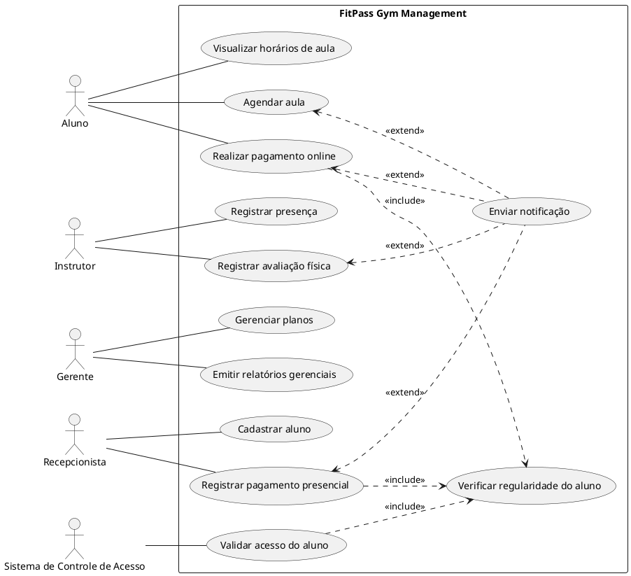

---

```plantuml
@startuml
left to right direction

actor Aluno
actor Instrutor
actor Gerente
actor Recepcionista
actor "Sistema de Controle de Acesso" as Catraca

rectangle "FitPass Gym Management" {

  Aluno -- (Agendar aula)
  Aluno -- (Realizar pagamento online)
  Aluno -- (Visualizar horários de aula)

  Recepcionista -- (Cadastrar aluno)
  Recepcionista -- (Registrar pagamento presencial)

  Instrutor -- (Registrar presença)
  Instrutor -- (Registrar avaliação física)

  Gerente -- (Gerenciar planos)
  Gerente -- (Emitir relatórios gerenciais)

  Catraca -- (Validar acesso do aluno)

  (Validar acesso do aluno) ..> (Verificar regularidade do aluno) : <<include>>
  (Registrar pagamento presencial) ..> (Verificar regularidade do aluno) : <<include>>
  (Realizar pagamento online) ..> (Verificar regularidade do aluno) : <<include>>

  (Agendar aula) <.. (Enviar notificação) : <<extend>>
  (Registrar avaliação física) <.. (Enviar notificação) : <<extend>>
  (Registrar pagamento presencial) <.. (Enviar notificação) : <<extend>>
  (Realizar pagamento online) <.. (Enviar notificação) : <<extend>>
}

@enduml
```
---
