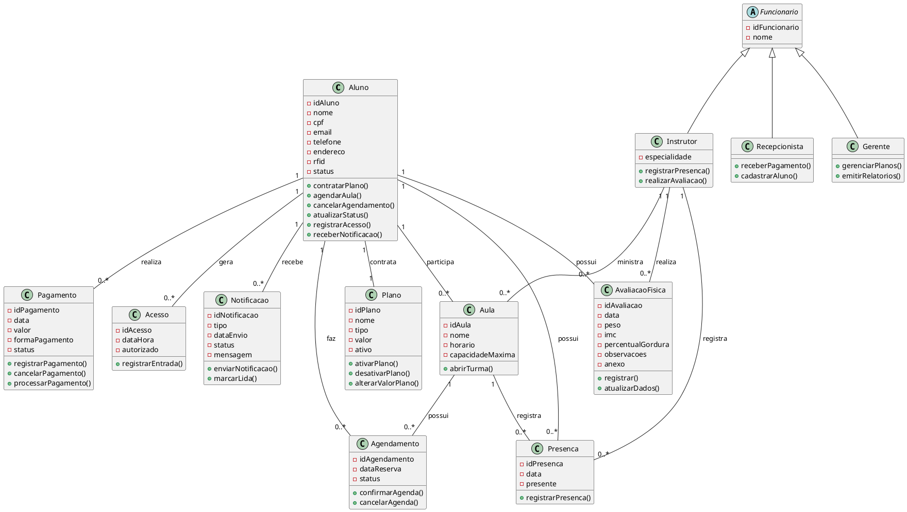

***Aluno*** - RF01, RF04, RF05, RF06, RF10
- idAluno
- nome
- cpf
- email
- telefone
- endereco
- rfid
- status
+ contratarPlano()
+ agendarAula()
+ cancelarAgendamento()
+ atualizarStatus()
+ registrarAcesso()
+ receberNotificacao()

***Plano*** - RF01, RF02, RF04
- idPlano
- nome
- tipo
- valor
- ativo
+ ativarPlano()
+ desativarPlano()
+ alterarValorPlano()

***Pagamento*** - RF03, RF04, RF09
- idPagamento
- data
- valor
- formaPagamento
- status
+ registrarPagamento()
+ cancelarPagamento()
+ processarPagamento()

***Acesso*** - RF05, RF09
- idAcesso
- dataHora
- autorizado
+ registrarEntrada()

***Aula*** - RF06, RF07, RF09
- idAula
- nome
- horario
- capacidadeMaxima
+ abrirTurma()

***Agendamento*** - RF06, RF10
- idAgendamento
- dataReserva
- status
+ confirmarAgenda()
+ cancelarAgenda()

***Presenca*** - RF07
- idPresenca
- data
- presente
+ registrarPresenca()

***AvaliacaoFisica*** - RF08, RF10
- idAvaliacao
- data
- peso
- imc
- percentualGordura
- observacoes
- anexo
+ registrar()
+ atualizarDados()

***Notificacao*** - RF10
- idNotificacao
- tipo
- dataEnvio
- status
- mensagem
+ enviarNotificacao()
+ marcarLida()

***Funcionario*** (Classe Abstrata)
- idFuncionario
- nome

***Instrutor*** - RF07, RF08
- especialidade
+ registrarPresenca()
+ realizarAvaliacao()

***Recepcionista*** - RF01, RF03
+ receberPagamento()
+ cadastrarAluno()

***Gerente*** - RF02, RF09
+ gerenciarPlanos()
+ emitirRelatorios()

---

